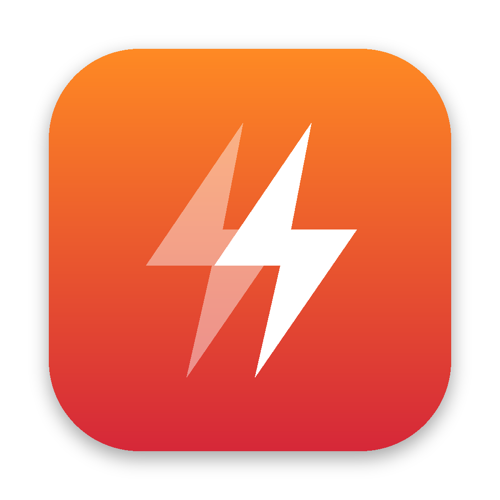

# Dual Recorder



A small native macOS app for dual recording on Zwift. It connects to your Bluetooth sensors (Favero Assioma pedals or any other power meter, a heart-rate strap and your smart trainer), records the event, and writes a FIT file per power source to your **Documents** folder for you to upload for verification.

It replaces the "record the pedals on a head unit → phone → Mac → upload" routine.

## Features

- **Any standard Bluetooth sensor:** power meters (Cycling Power), heart-rate straps and smart trainers (FTMS, or Cycling Power on older trainers).
- **Record switch per sensor:** choose which sensors to record. A sensor switched off is disconnected (freeing it for other devices) and left out of rides.
- **Connection indicator:** each sensor shows *Connected*, *Connected · no data*, *Searching…* or *Off*, and a summary line above Start ("All 3 sensors connected" / "2 of 3 sensors connected") shows at a glance whether you're ready.
- **Runs alongside Zwift on the same Mac.** Sensors Zwift is already connected to (trainer, HR strap) are shared rather than taken over, and the app never sends anything to the trainer, so Zwift keeps control of resistance.
- **One FIT file per power source**, e.g. `2026-10-09 1830 ZRL Race - Assioma.fit` and `… - KICKR.fit`. Each includes heart rate. Power, cadence and L/R balance are recorded every second.
- **Zero offset** button for power meters (standard Bluetooth offset compensation, like a head unit does).
- **Dropout alerts:** an alert sound and a notification if a sensor stops sending data mid-ride, another when it's back, and a warning if a saved sensor hasn't sent anything a minute into the ride.
- **Live pedals vs trainer gap**, over the last 10 s and the whole ride.
- **Post-ride summary:** avg / NP / max power, cadence, HR, data coverage per source, and the average difference between sources.
- **Window and menu bar:** the menu bar shows live power and recording state, so you can start and stop without leaving Zwift.
- **Crash-safe:** every second is also written to disk. If the Mac or app dies mid-ride, the next launch offers to save the ride.
- **Keeps the Mac awake** while recording, and asks before quitting if a ride is in progress.

## Download

1. Download the latest **Dual-Recorder-x.y.z.dmg** from [Dual Recorder releases](https://github.com/capceri/ftp-plus-oauth/releases?q=dual-recorder&expanded=true).
2. Open it and drag **Dual Recorder** into **Applications**.
3. Open it from Launchpad or Spotlight.

It needs macOS 14 Sonoma or later and runs on Apple Silicon and Intel Macs. Releases are signed and notarized by Apple, so they open without warnings. [RELEASING.md](RELEASING.md) explains how releases are made.

## Build from source

You need macOS 14 or later and either Xcode or the free Command Line Tools (`xcode-select --install`).

```bash
git clone https://github.com/capceri/ftp-plus-oauth.git
cd ftp-plus-oauth/dual-recorder
./build.sh
```

This compiles the app, signs it for this Mac and installs **Dual Recorder.app** in `/Applications` (or `~/Applications` if that isn't writable). To update later: `git pull && ./build.sh`.

On first launch macOS asks for:
- **Bluetooth:** allow it, or no sensors can connect.
- **Notifications:** allow it to get dropout banners. The alert sound plays either way.
- **Documents folder:** allow it so FIT files can be saved there.

> After each rebuild macOS may ask for Bluetooth permission again, because the locally signed app looks new to it. That's expected.

## Using it

1. **Add sensors (once):** turn the Assioma cranks to wake them, click **Add Sensor…** and add the pedals, plus your HR strap and trainer if you want those recorded. Sensors are remembered and reconnect automatically whenever they're awake. Use each sensor's switch to choose whether it's recorded (switches are locked while recording). Use the **⋯** menu on a sensor to rename it (the name goes into the file name), mark a power sensor as *power meter* or *smart trainer*, or forget it.
2. **Before the event:** unclip, keep the cranks still and click **Zero Offset** on the pedals.
3. **Check the connection line** above Start shows all your sensors connected, then **start recording** from the window or the menu bar. Optionally type the event name first (or during the ride); it's added to the file name.
4. **Ride.** The menu bar shows live pedal power. If a sensor drops out you'll hear a warning.
5. **Stop & Save.** The FIT files appear in `~/Documents` and a summary pops up. Upload the **Assioma** file wherever the event asks for your dual recording (e.g. ZwiftPower).

### Important for dual recording

- **Don't pair the Assioma pedals in Zwift.** Zwift should use the trainer as its power source. Otherwise both recordings come from the same device.
- Standard Assioma pedals accept only **one Bluetooth connection** at a time. Turn off your Wahoo (or anything else that might grab them over Bluetooth); ANT+ connections are unaffected.
- Assioma Duo pedals should be in the default "merged" Bluetooth mode (one device for both pedals, set in the Favero Assioma app) so that total power and L/R balance come through.
- Records are timestamped with the Mac's clock, which is what lets verification tools line them up with your Zwift file.

## How data is recorded

- One FIT `record` per second. Each second holds the mean of the readings received during it. If none arrived, the last value is carried forward for up to 3 s, which smooths over normal Bluetooth jitter.
- If a sensor stays silent longer than that, those seconds have **no** power value rather than a fake zero. Verification tools see a gap, and the summary's "Data" column shows the coverage.
- Coasting is recorded as 0 W / 0 rpm, as the sensor reports it.
- Cadence comes from the power meter's crank-revolution data (FTMS cadence for trainers).
- The files are standard FIT activities (indoor cycling) with file_id, device_info, event, record, lap, session and activity messages. They're checked against Garmin's official FIT SDK in CI.

## Development

```
Sources/DualRecorderCore   platform-independent logic (unit-tested on macOS and Linux)
  GATTParsers.swift          Cycling Power, FTMS Indoor Bike Data, Heart Rate, control point, cadence
  SecondSampler.swift        readings → one value per sensor per second
  RideStats.swift            averages, Normalized Power, source comparison, summary
  FITWriter.swift            low-level FIT encoding (definitions, CRC)
  FITActivityEncoder.swift   FIT activity file layout
  RideExporter.swift         one file per power source, file naming
  RideJournal.swift          crash-recovery journal
Sources/DualRecorder       the macOS app (SwiftUI + CoreBluetooth)
scripts/validate_fit.py    decodes FIT files with Garmin's FIT SDK and sanity-checks them
scripts/release.sh         signed + notarized DMG (scripts/make_dmg.sh does the packaging)
```

```bash
swift test                                         # unit tests
mkdir -p /tmp/fit && FIT_OUTPUT_DIR=/tmp/fit swift test --filter FITTests
python3 -m venv .venv && .venv/bin/pip install garmin-fit-sdk
.venv/bin/python scripts/validate_fit.py /tmp/fit  # check generated sample files
```

GitHub Actions (`.github/workflows/dual-recorder.yml` at the repo root) builds the app on macOS for every push that touches `dual-recorder/`. It runs the tests, validates sample FIT files, builds a universal app, and attaches an unsigned test DMG to the run. Pushing a `dual-recorder-v*` tag runs `.github/workflows/dual-recorder-release.yml`, which builds the signed, notarized DMG and publishes it as a release (see [RELEASING.md](RELEASING.md)).
