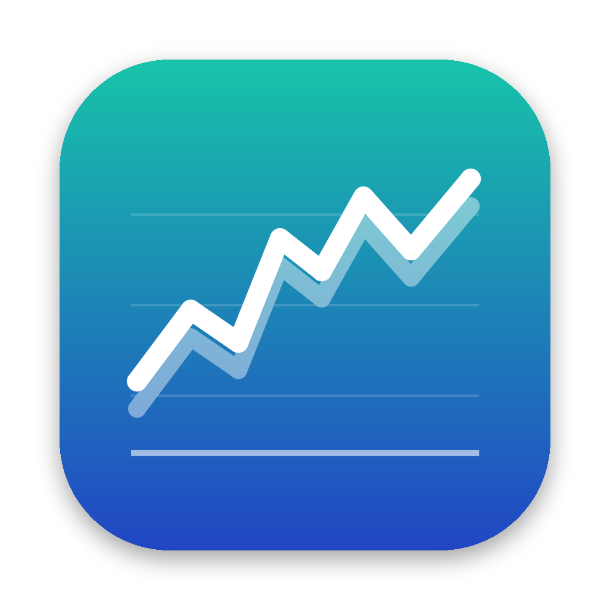

# FIT Studio



A native macOS app for FIT activity files: analyse them, adjust the recorded values by a percentage, plot any channel, and compare recordings of the same ride side by side. It reads files from any device or app (Garmin, Wahoo, Zwift, [Dual Recorder](../dual-recorder), …).

## Features

- **Adjust by percentage.** Pick a percentage for any channel (power, heart rate, cadence, speed, distance, elevation, developer fields such as Stryd power, …), or set every channel at once. Every recorded value of that channel is multiplied by it, e.g. −2.5% turns 200 W into 195 W.
  - Lap and session values that come from the records are updated to match: averages, maximums, totals, Normalized Power, work, Intensity Factor and TSS. The file stays consistent.
  - Everything else (GPS, devices, events, developer data) is copied byte for byte and the checksum is recomputed. Your original file is never changed. **Save Adjusted Copy** writes a new one.
  - Optionally keep speed and distance in step. Missing values stay missing, and values are clamped to what the field can hold.
- **Charts.** Stacked charts for the channels you choose, against time or distance.
  - Hover to read every value at that moment. Drag to select a range and see its duration, distance, averages, maximums and NP, then zoom into it.
  - Smoothing of 3–60 s. Pending adjustments are drawn over the original, which is dashed.
- **Compare.** Open two or more recordings, e.g. pedals vs trainer from Dual Recorder, or a head unit vs Zwift.
  - Line them up by clock time or by the start of each file, with an offset per file and **Auto** alignment that finds the best match.
  - See them overlaid, the difference over time (% or units), and a results table: average difference, mean absolute and RMS difference, correlation, and a linear fit (`other ≈ 1.03 × reference + 2`).
  - A breakdown by power level shows whether an error is a scale or an offset. There's also a second-by-second scatter plot and power curves.
  - Each compared file gets a **suggested correction**. **Apply…** opens that file's Adjust tab with it filled in.
- **Summary.** Duration, distance, power (average, NP, max, work, VI, and IF/TSS from your FTP), heart rate, cadence, speed, climbing and temperature. Also min/avg/max and data coverage for every channel, the power curve, per-lap stats, a route map, devices (with battery and firmware) and file details.
- **Data and Messages.** Every record in a table (or exported as CSV), and an inspector that shows every message in the file with field names, values, units and the stored raw values.
- **Robust reading:** compressed timestamps, big-endian files, developer fields, chained files, and incomplete files (a watch that crashed mid-ride). The adjusted copy of an incomplete file gets a valid header and checksum.
- **Metric or imperial** units, and your FTP, in Settings (⌘,).

## Download

1. Download the latest **FIT-Studio-x.y.z.dmg** from [FIT Studio releases](https://github.com/capceri/ftp-plus-oauth/releases?q=fit-studio&expanded=true).
2. Open it and drag **FIT Studio** into **Applications**.
3. Open it from Launchpad or Spotlight.

It needs macOS 14 Sonoma or later and runs on Apple Silicon and Intel Macs. Releases are signed and notarized by Apple. [RELEASING.md](RELEASING.md) explains how they're made.

## Build from source

You need macOS 14 or later and either Xcode or the free Command Line Tools (`xcode-select --install`).

```bash
git clone https://github.com/capceri/ftp-plus-oauth.git
cd ftp-plus-oauth/fit-studio
./build.sh
```

This compiles the app, signs it for this Mac and installs **FIT Studio.app** in `/Applications` (or `~/Applications`). To update later: `git pull && ./build.sh`.

## Using it

1. **Open files:** drop `.fit` files on the window, use **File › Open** (⌘O), or right-click a file in Finder and choose **Open With › FIT Studio**. Each file appears in the sidebar.
2. **Summary / Charts / Data / Messages** (⌘1–⌘5) look at the selected file.
3. **Adjust** (⌘3): set a percentage on the channels you want, check the before/after averages and the charts, then **Save Adjusted Copy** (⌘S). By default the copy is saved next to the original as `… (adjusted).fit`.
4. **Compare** (⌘K, or the top of the sidebar): choose the reference (e.g. the trainer) and the files to compare with it, and the channel.
   - If the files are two recordings of the same ride, keep **Clock time**. If the clocks disagree, press **Auto**.
   - For two separate rides of the same route or workout, choose **Start of each file**.
   - To make a file match the reference, press **Apply…** next to its suggested correction, then save the adjusted copy.

### Good to know

- Percentages apply to real units: speed in m/s, elevation in metres, temperature in °C. For elevation and temperature a percentage scales the value from zero, so +10% turns 200 m into 220 m.
- *Balance (right)* is a split, not a measurement, so it isn't scaled. *Accumulated power* follows Power automatically.
- Only channels you set are changed. Lap and session values are scaled by the same factor, which is exact for averages, maximums and totals. TSS scales with the square, because it depends on intensity twice.
- The comparison compares seconds where both files have data. **Ignore seconds where either is zero** leaves out coasting, which often starts a second earlier on one device.
- If an adjusted file is used for race verification, check the organiser's rules on edited files first.

## Command line

The same features without the app (also builds on Linux):

```bash
swift build -c release --product fitstudio
BIN="$(swift build -c release --show-bin-path)/fitstudio"
$BIN info ride.fit                                   # summary, channels, devices, messages
$BIN adjust ride.fit ride-adjusted.fit --power -2.5  # any channel name from `info`
$BIN adjust ride.fit all-up.fit --all 3              # every adjustable channel
$BIN compare trainer.fit pedals.fit --channel power --auto-align --ignore-zeros
$BIN csv ride.fit ride.csv --imperial
```

## Development

```
Sources/FITStudioCore     platform-independent logic (unit-tested on macOS and Linux)
  FITFile.swift             lossless decoder: definitions, messages, compressed timestamps, CRC
  FITBaseType.swift         reading and writing FIT base types (invalid values, clamping, endianness)
  FITProfile*.swift         field names, scales, units and enum names (generated from Garmin's SDK)
  Activity.swift            records → channels (merging enhanced fields), devices, laps, file info
  Analysis.swift            per-second resampling, stats, NP, power curve, smoothing, chart downsampling
  FITAdjuster.swift         percentage adjustment, linked summary fields, checksums, repair
  Comparison.swift          alignment, auto-align, difference statistics, bands, suggested correction
  FITInspector.swift        message/field formatting for the Messages view
  Units.swift               metric/imperial and CSV export
Sources/FITStudio         the macOS app (SwiftUI + Swift Charts + MapKit)
Sources/fitstudio-cli     the command-line tool
scripts/generate_profile.py   regenerates FITProfileData.swift from the garmin-fit-sdk package
scripts/make_test_fixture.py  writes the test fixture with Garmin's own encoder
scripts/validate_fit.py       checks adjusted files against the originals with Garmin's FIT SDK
scripts/release.sh            signed + notarized DMG (scripts/make_dmg.sh does the packaging)
```

```bash
swift test                                                   # unit tests
mkdir -p /tmp/fit && FIT_OUTPUT_DIR=/tmp/fit swift test --filter SampleFileTests
python3 -m venv .venv && .venv/bin/pip install garmin-fit-sdk
.venv/bin/python scripts/validate_fit.py /tmp/fit            # independent check of adjusted files
```

GitHub Actions (`.github/workflows/fit-studio.yml` at the repo root) runs on every push that touches `fit-studio/`. It runs the tests, checks the adjusted sample files with Garmin's FIT SDK, exercises the CLI, builds a universal app, and attaches an unsigned test DMG to the run. Pushing a `fit-studio-v*` tag runs `.github/workflows/fit-studio-release.yml`, which publishes a signed, notarized DMG (see [RELEASING.md](RELEASING.md)).
